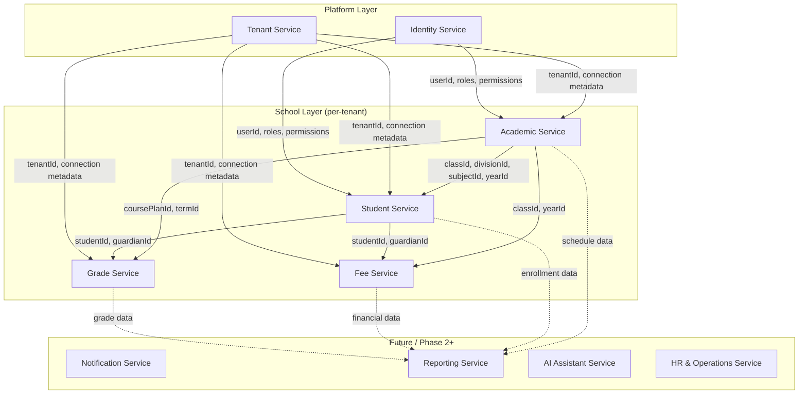

# Bounded Contexts and Microservice Boundaries

> Maps the current monolith domains to the six target microservices plus ancillary services for modules that do not fit the core six.

---

## Context Map Overview



---

## Target Microservices

### 1. Identity Service

**Bounded context:** User authentication, authorization, and platform-wide identity.

**Owns (Master DB):**

| Entity / Table | Notes |
|----------------|-------|
| `ApplicationUser` (+ AspNet Identity tables) | Core user store |
| `RefreshToken` | Token lifecycle |
| `Permission` | Permission catalog |
| `RolePermission` | Role ↔ permission mapping |

**Controllers:**

- `AuthController` — `Register`, `Login`, `refresh`, `logout`
- `RolePermissionsController`

**Services:**

- `PermissionClaimService`
- `RolePermissionAdminService`
- `PermissionSeeder`
- `UsersRepository` (wraps `UserManager`)

**Authorization infrastructure:**

- `HasPermissionAttribute`, `PermissionAuthorizationHandler`, `PermissionRequirement`
- `PagePermissionNames`, `SchoolUserRoleKeys`
- JWT issuance and validation (today in `Program.cs`; moves here)

**API surface (proposed):**

```
POST /api/auth/register
POST /api/auth/login
POST /api/auth/refresh
POST /api/auth/logout
GET  /api/users/{id}
POST /api/users                    (internal: called by Student/Academic services)
GET  /api/role-permissions
PUT  /api/role-permissions
```

**Does NOT own:** Tenant membership (`UserTenant`), tenant provisioning, or school business data.

---

### 2. Tenant Service

**Bounded context:** Multi-tenancy platform — school onboarding, tenant registry, subscriptions, registration workflow.

**Owns (Master DB):**

| Entity / Table | Notes |
|----------------|-------|
| `Tenant` | School registry + connection strings |
| `UserTenant` | User ↔ tenant membership and `TenantRole` |
| `Subscription` | Billing/subscription state |
| `TenantSettings` | Per-tenant key-value config |
| `RegistrationRequest` | Self-service registration |
| `RegistrationRequestAttachment` | Registration file attachments |

**Controllers:**

- `TenantController`
- `TenantSeedController`
- `DatabaseRestoreController`
- `AuthController.RegistrationRequests` partial — `PublicSchools`, `RequestRegistration`, `PendingRequests`, `ApproveRequest`, `RejectRequest`
- `AuthController` partial — `my-tenants`, `select-tenant` (issues tenant-scoped JWT)

**Services:**

- `TenantRepository`
- `TenantProvisioningService` — creates SQL database, runs tenant migrations, seeds school
- `TenantMembershipService`
- `TenantDemoDataSeeder`
- `TenantDatabaseFixService`
- `SqlRestoreService`

**Infrastructure:**

- `TenantResolutionMiddleware` logic → becomes a **lookup API** consumed by API Gateway or each service
- Tenant connection string cache (today `IMemoryCache` in middleware)

**API surface (proposed):**

```
GET  /api/tenants
POST /api/tenants                  (provision new school)
GET  /api/tenants/{id}/connection  (internal, mTLS)
POST /api/auth/my-tenants
POST /api/auth/select-tenant
GET  /api/auth/public-schools
POST /api/auth/request-registration
GET  /api/auth/pending-requests
POST /api/auth/approve-request
POST /api/auth/reject-request
```

**Cross-context note:** `select-tenant` today re-issues a JWT with `TenantId` claim and permission claims from Identity. In microservices, this becomes a **BFF or Gateway orchestration** calling Identity + Tenant.

---

### 3. Student Service

**Bounded context:** Student and guardian lifecycle, enrollment, and student-specific attachments.

**Owns (Tenant DB tables):**

| Table | Entity |
|-------|--------|
| `Students` | `Student` |
| `Guardians` | `Guardian` |
| `Attachments` | `Attachments` (student/guardian scoped) |
| `AccountStudentGuardians` | `AccountStudentGuardian` *(shared with Fee — see below)* |

**Controllers:**

- `StudentsController`
- `GuardianController`
- `FileController` (student/guardian uploads)

**Repositories / Services:**

- `StudentRepository`
- `GuardianRepository`
- `StudentManagementService` *(orchestrator — spans Identity + Fee today)*
- `AttachmentsRepository` (partial)

**External references (not owned):**

| FK / Field | References | Resolution |
|------------|------------|------------|
| `Student.UserID` | Identity `ApplicationUser.Id` | Store as opaque `userId`; create users via Identity API |
| `Guardian.UserID` | Identity `ApplicationUser.Id` | Same |
| `Student.DivisionID` | Academic `Division` | Validate via Academic API |
| `Student.GuardianID` | Owned | — |
| `AccountStudentGuardian.*` | Fee `Accounts` | Saga/outbox with Fee Service |

**Saga: Add Student with Guardian** (today one SQL transaction in `StudentManagementService`):

1. Identity Service → create guardian user, student user
2. Student Service → create guardian, student, attachments
3. Fee Service → create account, account-student-guardian link, student class fees

---

### 4. Academic Service

**Bounded context:** School structure, academic calendar, staffing, instructional delivery, and operational school workflows (excluding grade entry and fee collection).

**Owns (Tenant DB tables):**

#### School structure and calendar

| Table | Entity |
|-------|--------|
| `Schools` | `School` |
| `Classes` | `Class` |
| `Stages` | `Stage` |
| `Divisions` | `Division` |
| `Subjects` | `Subject` |
| `Years` | `Year` |
| `Terms` | `Term` |
| `Months` | `Month` |
| `YearTermMonths` | `YearTermMonth` |
| `Curriculums` | `Curriculum` |
| `CoursePlans` | `CoursePlan` |
| `WeeklySchedules` | `WeeklySchedule` |

#### Staffing

| Table | Entity |
|-------|--------|
| `Teachers` | `Teacher` |
| `Managers` | `Manager` |
| `SchoolStaff` | `SchoolStaff` |
| `Salarys` | `Salary` *(financial but tied to HR — consider Fee Service ownership)* |
| `EmployeeProfiles` | `EmployeeProfile` |
| `EmployeeJobTypes` | `EmployeeJobType` |
| `EmployeeQualifications` | `EmployeeQualification` |
| `EmployeeSpecializations` | `EmployeeSpecialization` |
| `EmployeeHistories` | `EmployeeHistory` |
| `EmployeeDocuments` | `EmployeeDocument` |
| `EmployeeLeaves` | `EmployeeLeave` |
| `EmployeePerformanceSummaries` | `EmployeePerformanceSummary` |
| `EmployeeYearAssignments` | `EmployeeYearAssignment` |

#### Instructional delivery

| Table | Entity |
|-------|--------|
| `Attendances` | `Attendance` |
| `HomeworkTasks` | `HomeworkTask` |
| `HomeworkTaskLinks` | `HomeworkTaskLink` |
| `HomeworkSubmissions` | `HomeworkSubmission` |
| `HomeworkSubmissionFiles` | `HomeworkSubmissionFile` |
| `ExamSessions` | `ExamSession` |
| `ExamTypes` | `ExamType` |
| `ScheduledExams` | `ScheduledExam` |
| `ExamResults` | `ExamResult` |

#### HR operations (Phase 2 candidate for separate HR Service)

| Table | Entity |
|-------|--------|
| `JobPostings` | `JobPosting` |
| `JobApplications` | `JobApplication` |
| `RecruitmentInterviews` | `Interview` |
| `CandidateEvaluations` | `CandidateEvaluation` |
| `HiringDecisions` | `HiringDecision` |
| `RequestTypes` | `RequestType` |
| `EmployeeRequests` | `EmployeeRequest` |
| `RequestApprovalSteps` | `RequestApprovalStep` |
| `RequestExecutions` | `RequestExecution` |
| `RequestDailySummaries` | `RequestDailySummary` |
| `TimeCapsules` | `TimeCapsule` |
| `TimeCapsuleSections` | `TimeCapsuleSection` |
| `ResignationRequests` | `ResignationRequest` |
| `CapsuleUnlockApprovals` | `CapsuleUnlockApproval` |
| `CapsuleNarratives` | `CapsuleNarrative` |
| `CapsuleAccessLogs` | `CapsuleAccessLog` |

#### School operations (Phase 2 candidate)

| Table | Entity |
|-------|--------|
| `ViolationTypes` | `ViolationType` |
| `Violations` | `Violation` |
| `ViolationResponses` | `ViolationResponse` |
| `ViolationActions` | `ViolationAction` |
| `ViolationEscalationHistories` | `ViolationEscalationHistory` |
| `ConcernCategories` | `ConcernCategory` |
| `Complaints` | `Complaint` |
| `Suggestions` | `Suggestion` |
| `ConcernActionLogs` | `ConcernActionLog` |
| `Meetings` | `Meeting` |
| `MeetingAttendees` | `MeetingAttendee` |
| `MeetingMinutes` | `MeetingMinutes` |
| `MeetingTasks` | `MeetingTask` |
| `MeetingTaskFollowUps` | `MeetingTaskFollowUp` |
| `ActivityRequests` | `ActivityRequest` |
| `ActivityApprovals` | `ActivityApproval` |
| `ActivityExecutions` | `ActivityExecution` |
| `ActivityEvaluations` | `ActivityEvaluation` |
| `ActivityPoints` | `ActivityPoints` |
| `StrategicGoals` | `StrategicGoal` |
| `AnnualGoals` | `AnnualGoal` |
| `OperationalPlans` | `OperationalPlan` |
| `PlanTasks` | `PlanTask` |
| `PlanProgressUpdates` | `PlanProgressUpdate` |
| `DepartmentGoals` | `DepartmentGoal` |
| `SupervisorVisits` | `SupervisorVisit` |
| `VisitObservations` | `VisitObservation` |
| `VisitRecommendations` | `VisitRecommendation` |
| `RecommendationFollowUps` | `RecommendationFollowUp` |
| `TeacherFeedbackCycles` | `TeacherFeedbackCycle` |
| `FeedbackQuestions` | `FeedbackQuestion` |
| `StudentFeedbacks` | `StudentFeedback` |
| `ParentFeedbacks` | `ParentFeedback` |
| `FeedbackSummaries` | `FeedbackSummary` |
| `Achievements` | `Achievement` |
| `AchievementRequests` | `AchievementRequest` |
| `AchievementApprovals` | `AchievementApproval` |
| `AchievementAttachments` | `AchievementAttachment` |
| `AchievementPointsLedgers` | `AchievementPointsLedger` |
| `PointsSources` | `PointsSource` |
| `PointsRules` | `PointsRule` |
| `PointsTransactions` | `PointsTransaction` |
| `PointsLedgers` | `PointsLedger` |
| `PointsBalanceSnapshots` | `PointsBalanceSnapshot` |
| `Awards` | `Award` |
| `AwardCriteria` | `AwardCriteria` |
| `AwardCycles` | `AwardCycle` |
| `AwardNominations` | `AwardNomination` |
| `AwardWinners` | `AwardWinner` |

**Controllers (Academic Service):**

`SchoolController`, `ClassesController`, `StagesController`, `DivisionController`, `SubjectController`, `YearController`, `TermController`, `MonthController`, `CurriculmsController`, `CoursePlansController`, `WeeklyScheduleController`, `TeacherController`, `ManagerController`, `EmployeeController`, `EmployeesController`, `AttendanceController`, `HomeworkController`, `ExamsController`, `DailyEvaluationController`, `RecruitmentController`, `EmployeeRequestController`, `TimeCapsuleController`, `ViolationController`, `ConcernController`, `MeetingController`, `ActivityController`, `AchievementRequestController`, `CentralPointsController`, `SupervisorVisitController`, `TeacherFeedbackController`, `TeacherWorkspaceController`, `OrganizationalPlanController`

**Repositories / Services:**

All corresponding `Repository/School/*` implementations, plus `EmployeeProfileService`, `EmployeeYearAssignmentService`, `RecruitmentService`, `DailyEvaluationService`, `TimeCapsuleService`, `AutomaticWeeklyScheduleService`, `SchoolRoleResolver`

**External references:**

| FK / Field | References | Resolution |
|------------|------------|------------|
| `Teacher.UserID`, `Manager.UserID` | Identity | Create users via Identity API |
| `Teacher.ManagerID` | Academic `Manager` | Internal |
| `Attendance.StudentID` | Student Service | Validate via Student API |
| `HomeworkSubmission.StudentID` | Student Service | Validate via Student API |
| `ExamResult.StudentID` | Student Service | Validate via Student API |

**Note:** Academic Service is the largest bounded context. In a later phase, consider splitting **HR & Operations** and **Engagement** (points, awards, feedback) into separate services.

---

### 5. Grade Service

**Bounded context:** Grade configuration, grade entry, grade locking, and grade-related reporting inputs.

**Owns (Tenant DB tables):**

| Table | Entity |
|-------|--------|
| `GradeTypes` | `GradeType` |
| `MonthlyGrades` | `MonthlyGrade` |
| `TermlyGrades` | `TermlyGrade` |
| `DailyEvaluationTemplates` | `DailyEvaluationTemplate` |
| `DailyEvaluationCriteria` | `DailyEvaluationCriteria` |
| `DailyEvaluations` | `DailyEvaluation` |
| `DailyEvaluationItems` | `DailyEvaluationItem` |
| `EvaluationLocks` | `EvaluationLock` |
| `EvaluationOverrideLogs` | `EvaluationOverrideLog` |

**Controllers:**

- `GradeTypesController`
- `MonthlyGradesController`
- `TermlyGradeController`
- `DailyEvaluationController` *(split from Academic if evaluations are grade-adjacent)*

**Repositories / Services:**

- `GradeTypesRepository`
- `MonthlyGradeRepository`
- `TermlyGradeRepository`
- `DailyEvaluationService`

**External references:**

| FK / Field | References | Resolution |
|------------|------------|------------|
| `MonthlyGrade.StudentID` | Student Service | `studentId` as external ID |
| `MonthlyGrade.SubjectID` | Academic Service | `subjectId` as external ID |
| `MonthlyGrade.YearID`, `MonthID`, `TermID` | Academic Service | Calendar IDs |
| `TermlyGrade.*` | Student + Academic | Same pattern |
| `DailyEvaluation.TeacherID` | Academic Service | `teacherId` |

**Read models:** `TeacherWorkspaceController` and `DashboardController` consume grade summaries — these become cross-service queries or a read-model projection.

---

### 6. Fee Service

**Bounded context:** Fee definitions, billing, payments, and guardian financial accounts.

**Owns (Tenant DB tables):**

| Table | Entity |
|-------|--------|
| `Fees` | `Fee` |
| `FeeClass` | `FeeClass` |
| `StudentClassFees` | `StudentClassFees` |
| `Accounts` | `Accounts` |
| `TypeAccounts` | `TypeAccount` |
| `Vouchers` | `Vouchers` |
| `AccountStudentGuardians` | `AccountStudentGuardian` *(shared write with Student Service)* |

**Controllers:**

- `FeesController`
- `FeeClassController`
- `VouchersController`
- `AccountsController`

**Repositories / Services:**

- `FeesRepository`
- `FeeClassRepository`
- `StudentClassFeeRepository`
- `AccountRepository`
- `VoucherRepository`
- `AccountStudentGuardianRepository`

**External references:**

| FK / Field | References | Resolution |
|------------|------------|------------|
| `StudentClassFees.StudentID` | Student Service | Validate enrollment |
| `StudentClassFees.ClassID` | Academic Service | Validate class exists |
| `FeeClass.ClassID`, `FeeClass.FeeID` | Academic + Fee | Internal + Academic |
| `AccountStudentGuardian.GuardianID`, `.StudentID` | Student Service | Saga coordination |
| `Vouchers` receipt totals | — | Dashboard aggregates via event or query API |

---

## Ancillary Services (Phase 2+)

These modules do not map cleanly to the six core services and should be extracted after the core split stabilizes.

| Proposed Service | Modules | Rationale |
|------------------|---------|-----------|
| **Notification Service** | `NotificationsController`, `NotificationMessage`, `NotificationDelivery` | Cross-cutting; consumed by all domains |
| **Reporting Service** | `ReportController`, `ReportTemplate`, `AnalyticsController`, analytics entities | Read-heavy; aggregates from all services |
| **AI Assistant Service** | `AiController`, `Services/Ai/*` | Already isolated; orchestrates tool calls across APIs |
| **File/Media Service** | `FileController`, `mangeFilesService`, `wwwroot/uploads` | Shared infrastructure |
| **Audit Service** | `AuditTrailService`, `AuditLog` | Cross-cutting compliance |

**Dashboard** (`DashboardController`, `DashboardRepository`) is a **read aggregator** — implement as BFF or use CQRS read models fed by domain events.

---

## Shared Kernel (Extract Early)

These concerns span all services and should become shared NuGet packages before service extraction:

| Package | Contents |
|---------|----------|
| `MySchool.Shared.Contracts` | `PagedResult`, `FilterRequest`, `Result`, common DTOs |
| `MySchool.Shared.Auth` | JWT validation middleware, `TenantId` claim parsing, permission claim reader |
| `MySchool.Shared.MultiTenancy` | `TenantInfo` contract, tenant header conventions |
| `MySchool.Shared.Events` | Domain event envelopes (`StudentEnrolled`, `GradePublished`, `PaymentReceived`) |

---

## Context Boundary Decisions

### `AccountStudentGuardian` — Student or Fee?

**Decision:** Fee Service owns the table; Student Service initiates creation via saga when enrolling a student with a new guardian. The monolith writes this in `StudentManagementService` step 5.

### `DailyEvaluation` — Academic or Grade?

**Decision:** Grade Service. Evaluations produce scored items tied to grade periods and locking (`EvaluationLock`). Academic Service owns the teacher and course-plan context.

### `Salary` — Academic (HR) or Fee?

**Decision:** Fee Service (payroll is financial). Academic Service owns the employee profile; Fee Service owns salary records.

### `ExamResults` — Academic or Grade?

**Decision:** Academic Service for now (exam module is cohesive with `ExamSession`, `ScheduledExam`). Grade Service consumes exam results for report cards via API or events. Revisit if exam results merge with `MonthlyGrade`/`TermlyGrade`.

### Platform admin cross-tenant catalog

**Decision:** Tenant Service exposes a **tenant catalog API**; a Platform BFF aggregates manager/school/dashboard data by fan-out to tenant-scoped services. Do not replicate the current pattern of opening raw tenant DB connections from a single repository.
