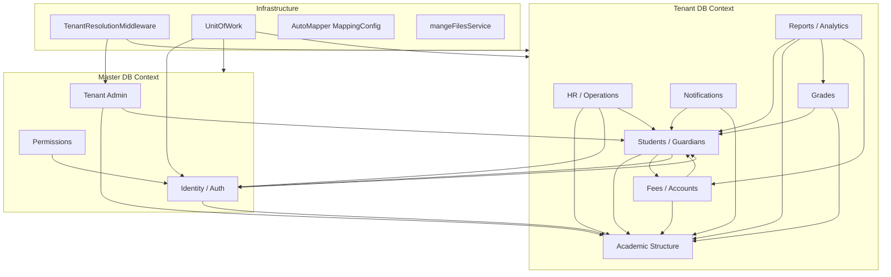

# Dependency Map

> Module-to-module dependencies, database table ownership, and coupling hotspots that will complicate microservice extraction.

---

## 1. High-Level Module Dependency Graph



---

## 2. Repository Dependency Matrix

Rows depend on columns (● = direct dependency).

| Repository | TenantDb | MasterDb | UserManager | IUserRepo | Other Repos | Services |
|------------|:--------:|:--------:|:-----------:|:---------:|:-----------:|:--------:|
| `UsersRepository` | | ● | ● | | | |
| `TenantRepository` | | ● | | | | |
| `GuardianRepository` | ● | | | ● | | |
| `StudentRepository` | ● | | | ● | `IGuardianRepository`, `IYearRepository` | `mangeFilesService`, `IApiBaseUrlProvider` |
| `TeacherRepository` | ● | | | ● | | `IEmployeeYearAssignmentService`, `IApiBaseUrlProvider` |
| `EmployeeRepository` | ● | | | ● | `IGuardianRepository`, `IStudentRepository` | `IEmployeeYearAssignmentService` |
| `ManagerRepository` | ● | ● | ● | ● | `ITenantRepository` | `IEmployeeYearAssignmentService`, `TenantInfo`, `IHttpContextAccessor` |
| `SchoolRepository` | ● | ● | | | `IYearRepository` | `TenantInfo`, `IHttpContextAccessor`, `IApiBaseUrlProvider` |
| `DashboardRepository` | ● | ● | | | | `TenantInfo`, `IHttpContextAccessor` |
| `MonthlyGradeRepository` | ● | | | | | `IAuditTrailService`, `IApiBaseUrlProvider` |
| `TermlyGradeRepository` | ● | | | | | `IAuditTrailService`, `IApiBaseUrlProvider` |
| `StudentClassFeeRepository` | ● | | | | | `IAuditTrailService` |
| `VoucherRepository` | ● | | | | | `mangeFilesService` |
| `ReportRepository` | ● | | | | | `HtmlSanitizationService`, `IApiBaseUrlProvider` |
| `NotificationRepository` | ● | | | | | `HtmlSanitizationService` |

### Cross-Database Repositories (Highest Extraction Risk)

These three repositories **directly instantiate additional `TenantDbContext` instances** by reading connection strings from the master `Tenants` table:

| Repository | Pattern | Used By |
|------------|---------|---------|
| `ManagerRepository` | `CreateTenantDbForTenantIdAsync()` | Platform admin manager catalog across all schools |
| `SchoolRepository` | `CreateTenantDbForTenantIdAsync()` | Platform admin school listing |
| `DashboardRepository` | Iterates all tenants, opens each DB | Platform admin dashboard aggregates |

**Migration impact:** This pattern cannot survive service extraction without a **Platform BFF** that fans out HTTP calls to per-tenant service instances or a **federated query layer**.

---

## 3. Service Orchestration Dependencies

| Service | Depends On | Crosses Boundaries |
|---------|------------|-------------------|
| `StudentManagementService` | `IUnitOfWork`, `UserManager`, `TenantDbContext` | Identity + Student + Fee in **one SQL transaction** |
| `TenantProvisioningService` | `DatabaseContext`, `UserManager`, `IUserRepository` | Master + creates new Tenant DB |
| `TenantMembershipService` | `DatabaseContext` | Master only |
| `PermissionClaimService` | `DatabaseContext` | Master; called at login |
| `SchoolAiToolsService` | Multiple repositories via DI | Reads students, grades, attendance, etc. |
| `AnalyticsService` | `IAnalyticsRepository` | Aggregates KPIs across academic + grade + fee data |
| `AutomaticWeeklyScheduleService` | `IWeeklyScheduleRepository`, course plans | Academic internal |
| `AuditTrailService` | `TenantDbContext` | Writes to shared `AuditLogs` table |

### Critical Saga: `StudentManagementService.AddStudentWithGuardianAsync`

```
┌─────────────────────────────────────────────────────────────────┐
│              Current: Single Tenant DB Transaction               │
├─────────────────────────────────────────────────────────────────┤
│ 1. Identity (Master)  → Create guardian user (via UserManager)  │
│ 2. Student (Tenant)   → Create guardian record                   │
│ 3. Identity (Master)  → Create student user                      │
│ 4. Student (Tenant)   → Create student record                    │
│ 5. Fee (Tenant)       → Create account                           │
│ 6. Fee (Tenant)       → Create AccountStudentGuardian            │
│ 7. Student (Tenant)   → Save attachments                         │
│ 8. Fee (Tenant)       → Create StudentClassFees                  │
└─────────────────────────────────────────────────────────────────┘
```

**Target:** Choreography saga with compensating transactions (delete user if student creation fails, etc.).

---

## 4. Database Tables by Module

### Master Database (`DatabaseContext`)

| Module | Tables |
|--------|--------|
| **Identity** | `AspNetUsers`, `AspNetRoles`, `AspNetUserRoles`, `AspNetUserClaims`, `AspNetRoleClaims`, `AspNetUserLogins`, `AspNetUserTokens`, `RefreshTokens`, `Permissions`, `RolePermissions` |
| **Tenant** | `Tenants`, `UserTenants`, `Subscriptions`, `TenantSettings`, `RegistrationRequests`, `RegistrationRequestAttachments` |

### Tenant Database (`TenantDbContext`) — by Target Microservice

#### Identity Service (references only — stored in tenant DB)

| Table | Column | Notes |
|-------|--------|-------|
| `Students` | `UserID` | FK to master `AspNetUsers.Id` (logical, not enforced cross-DB) |
| `Guardians` | `UserID` | Same |
| `Teachers` | `UserID` | Same |
| `Managers` | `UserID` | Same |

#### Student Service

| Table | Key Relationships |
|-------|-------------------|
| `Students` | → `Guardians`, `Divisions`, `MonthlyGrades`, `TermlyGrades`, `AccountStudentGuardians`, `StudentClassFees`, `Attachments` |
| `Guardians` | → `Students`, `AccountStudentGuardians` |
| `Attachments` | → `Students` (polymorphic) |

#### Academic Service

| Table Group | Tables |
|-------------|--------|
| Structure | `Schools`, `Classes`, `Stages`, `Divisions`, `Subjects` |
| Calendar | `Years`, `Terms`, `Months`, `YearTermMonths` |
| Curriculum | `Curriculums`, `CoursePlans`, `WeeklySchedules` |
| Staff | `Teachers`, `Managers`, `SchoolStaff`, `EmployeeProfiles`, `EmployeeJobTypes`, `EmployeeQualifications`, `EmployeeSpecializations`, `EmployeeHistories`, `EmployeeDocuments`, `EmployeeLeaves`, `EmployeePerformanceSummaries`, `EmployeeYearAssignments` |
| Instruction | `Attendances`, `HomeworkTasks`, `HomeworkTaskLinks`, `HomeworkSubmissions`, `HomeworkSubmissionFiles`, `ExamSessions`, `ExamTypes`, `ScheduledExams`, `ExamResults` |
| HR / Ops | `JobPostings`, `JobApplications`, `RecruitmentInterviews`, `CandidateEvaluations`, `HiringDecisions`, `RequestTypes`, `EmployeeRequests`, `RequestApprovalSteps`, `RequestExecutions`, `RequestDailySummaries`, `TimeCapsules`, `TimeCapsuleSections`, `ResignationRequests`, `CapsuleUnlockApprovals`, `CapsuleNarratives`, `CapsuleAccessLogs` |
| Conduct / Engagement | `ViolationTypes`, `Violations`, `ViolationResponses`, `ViolationActions`, `ViolationEscalationHistories`, `ConcernCategories`, `Complaints`, `Suggestions`, `ConcernActionLogs`, `Meetings`, `MeetingAttendees`, `MeetingMinutes`, `MeetingTasks`, `MeetingTaskFollowUps`, `ActivityRequests`, `ActivityApprovals`, `ActivityExecutions`, `ActivityEvaluations`, `ActivityPoints`, `StrategicGoals`, `AnnualGoals`, `OperationalPlans`, `PlanTasks`, `PlanProgressUpdates`, `DepartmentGoals`, `SupervisorVisits`, `VisitObservations`, `VisitRecommendations`, `RecommendationFollowUps`, `TeacherFeedbackCycles`, `FeedbackQuestions`, `StudentFeedbacks`, `ParentFeedbacks`, `FeedbackSummaries`, `Achievements`, `AchievementRequests`, `AchievementApprovals`, `AchievementAttachments`, `AchievementPointsLedgers`, `PointsSources`, `PointsRules`, `PointsTransactions`, `PointsLedgers`, `PointsBalanceSnapshots`, `Awards`, `AwardCriteria`, `AwardCycles`, `AwardNominations`, `AwardWinners` |

#### Grade Service

| Table | Key Relationships |
|-------|-------------------|
| `GradeTypes` | Configuration |
| `MonthlyGrades` | → `Students`, `Subjects`, `Years`, `Months`, `Terms` |
| `TermlyGrades` | → `Students`, `Subjects`, `Years`, `Terms` |
| `DailyEvaluationTemplates` | Template config |
| `DailyEvaluationCriteria` | → Templates |
| `DailyEvaluations` | → Teachers, criteria |
| `DailyEvaluationItems` | → Evaluations |
| `EvaluationLocks` | Period locking |
| `EvaluationOverrideLogs` | Audit of overrides |

#### Fee Service

| Table | Key Relationships |
|-------|-------------------|
| `Fees` | Fee definitions |
| `FeeClass` | → `Fees`, `Classes` |
| `StudentClassFees` | → `Students`, `Classes`, `Fees` |
| `Accounts` | Guardian financial accounts |
| `TypeAccounts` | Account type lookup |
| `Vouchers` | Payment receipts |
| `AccountStudentGuardians` | → `Accounts`, `Guardians`, `Students` |
| `Salarys` | → `Teachers` (HR link) |

#### Shared / Cross-Cutting (Tenant DB)

| Table | Used By | Target Owner |
|-------|---------|--------------|
| `AuditLogs` | All modules via `AuditTrailService` | Audit Service (Phase 2) |
| `NotificationMessages` | All modules | Notification Service (Phase 2) |
| `NotificationDeliveries` | Notifications | Notification Service (Phase 2) |
| `ReportTemplates` | Reports | Reporting Service (Phase 2) |
| `KpiDefinitions` | Analytics | Reporting Service (Phase 2) |
| `KpiSnapshots` | Analytics | Reporting Service (Phase 2) |
| `DepartmentAnalytics` | Analytics | Reporting Service (Phase 2) |
| `TeacherAnalytics` | Analytics | Reporting Service (Phase 2) |
| `SchoolAnalytics` | Analytics | Reporting Service (Phase 2) |
| `TrendAnalyses` | Analytics | Reporting Service (Phase 2) |

---

## 5. Entity Relationship Coupling (Cross-Module FKs)

These foreign keys within the **single tenant database** create logical coupling between target microservices:

```mermaid
erDiagram
    Student ||--o{ MonthlyGrade : has
    Student ||--o{ TermlyGrade : has
    Student ||--o{ StudentClassFees : billed
    Student }o--|| Guardian : belongs_to
    Student }o--|| Division : enrolled_in
    Division }o--|| Class : part_of
    Class }o--|| Stage : part_of
    Class }o--|| Year : for_year
    Student ||--o{ AccountStudentGuardian : linked
    AccountStudentGuardian }o--|| Accounts : account
    Guardian ||--o{ AccountStudentGuardian : pays
    FeeClass }o--|| Fee : defines
    FeeClass }o--|| Class : applies_to
    Teacher }o--|| Manager : reports_to
    CoursePlan }o--|| Teacher : taught_by
    CoursePlan }o--|| Subject : for_subject
    Attendance }o--|| Student : for_student
    HomeworkSubmission }o--|| Student : by_student
    ExamResult }o--|| Student : for_student
```

**Extraction strategy:** Replace FK enforcement with **service-level validation** and store external IDs. Use eventual consistency for non-critical links.

---

## 6. Controller → Repository → DbContext Chains

| Controller | Primary Repository | DbContext(s) | Cross-Service Data |
|------------|-------------------|--------------|-------------------|
| `StudentsController` | `StudentRepository`, `StudentManagementService` | Tenant + Master (users) | Identity, Fee |
| `MonthlyGradesController` | `MonthlyGradeRepository` | Tenant | Student, Academic |
| `FeesController` | `FeesRepository` | Tenant | Academic (classes) |
| `VouchersController` | `VoucherRepository` | Tenant | Student, Guardian |
| `DashboardController` | `DashboardRepository` | **Both** (all tenants) | Everything |
| `ManagerController` | `ManagerRepository` | **Both** (all tenants) | Identity |
| `SchoolController` | `SchoolRepository` | **Both** (all tenants) | — |
| `TeacherWorkspaceController` | Multiple via `IUnitOfWork` | Tenant | Grades, Academic |
| `AiController` | `SchoolAiAssistantService` | Tenant (via tools) | Multiple domains |
| `AuthController` | Direct EF + services | Master | Tenant (select-tenant) |
| `TenantController` | `TenantRepository`, `TenantProvisioningService` | Master + creates Tenant | Identity |

---

## 7. Coupling Severity Assessment

| Coupling | Severity | Location | Mitigation |
|----------|----------|----------|------------|
| `UnitOfWork` god-object | **Critical** | `UnitOfWork.cs` | Decompose per service; replace with service-local DI |
| Cross-DB user creation in student enrollment | **Critical** | `StudentManagementService` | Saga + Identity API |
| `UserID` in tenant entities | **High** | `Student`, `Teacher`, `Guardian`, `Manager` | Opaque external ID; no navigation to `ApplicationUser` |
| Multi-tenant DB fan-out | **High** | `ManagerRepository`, `SchoolRepository`, `DashboardRepository` | Platform BFF with parallel API calls |
| Shared `TenantDbContext` (80+ tables) | **High** | `TenantDbContext.cs` | Split into per-service DbContexts with separate schemas or DBs |
| Permission claims at login | **Medium** | `PermissionClaimService` | Keep in Identity; services trust JWT claims |
| `IAuditTrailService` shared writes | **Medium** | Grade, Fee repos | Event-driven audit or shared Audit Service |
| `mangeFilesService` shared file paths | **Medium** | Student, Voucher repos | File/Media Service with object storage |
| AutoMapper single profile | **Medium** | `MappingConfig.cs` | Split profiles per service |
| `SchoolAiToolsService` cross-domain reads | **Medium** | `Services/Ai/` | AI service calls other services' APIs |
| `HtmlSanitizationService` | **Low** | Reports, Notifications | Shared utility package |
| `IApiBaseUrlProvider` | **Low** | Multiple repos | Config in each service or gateway |

---

## 8. External Integration Points

| Integration | Current | Microservices Target |
|-------------|---------|---------------------|
| Angular SPA | Single API base URL | API Gateway / BFF |
| OpenAI API | `OpenAiChatCompletionService` | AI Assistant Service |
| SQL Server | Master + N tenant DBs | Same topology initially; optional schema-per-service within tenant DB |
| File storage | Local `wwwroot/uploads` | Object storage (S3/Azure Blob) via File Service |
| JWT | Symmetric key in `appsettings` | Identity Service as token issuer; other services validate |

---

## 9. NuGet / Infrastructure Dependencies (All Services Inherit Today)

```
AutoMapper ─────────────────► All mapping
EF Core SqlServer ──────────► Both DbContexts
Identity.EntityFrameworkCore ► Master only
JwtBearer + IdentityModel ──► Auth pipeline
HtmlSanitizer ──────────────► Reports, Notifications
Newtonsoft.Json ────────────► API serialization
Swashbuckle ────────────────► Swagger (per-service or gateway only)
```

---

## 10. Data Topology Today vs Target

### Today

```
┌──────────────────┐     ┌──────────────────────────────────────┐
│   Master DB      │     │  Tenant DB (School_A)                │
│  - Identity      │     │  - Students, Grades, Fees, ...       │
│  - Tenants       │     │  (all 80+ tables)                    │
│  - Permissions   │     └──────────────────────────────────────┘
└──────────────────┘     ┌──────────────────────────────────────┐
                         │  Tenant DB (School_B)                │
                         │  - Students, Grades, Fees, ...       │
                         └──────────────────────────────────────┘
         ▲
         │ Single monolith opens any DB
```

### Target (Phase 3+)

```
┌─────────────┐  ┌─────────────┐
│  Identity   │  │   Tenant    │
│  Master DB  │  │  Master DB  │  (or shared master with schema separation)
└─────────────┘  └─────────────┘

Per-tenant (option A: schema per service in same DB):
┌─────────────────────────────────────────────┐
│  Tenant DB (School_A)                       │
│  ├── student schema                         │
│  ├── academic schema                        │
│  ├── grade schema                           │
│  └── fee schema                             │
└─────────────────────────────────────────────┘

Per-tenant (option B: database per service — higher isolation):
┌──────────┐ ┌──────────┐ ┌──────────┐ ┌──────────┐
│ Student  │ │ Academic │ │  Grade   │ │   Fee    │
│   DB     │ │    DB    │ │    DB    │ │    DB    │
└──────────┘ └──────────┘ └──────────┘ └──────────┘
```

**Recommendation:** Start with **option A** (schema separation within existing tenant DB) to minimize operational change, then evolve to option B for services that need independent scaling.
