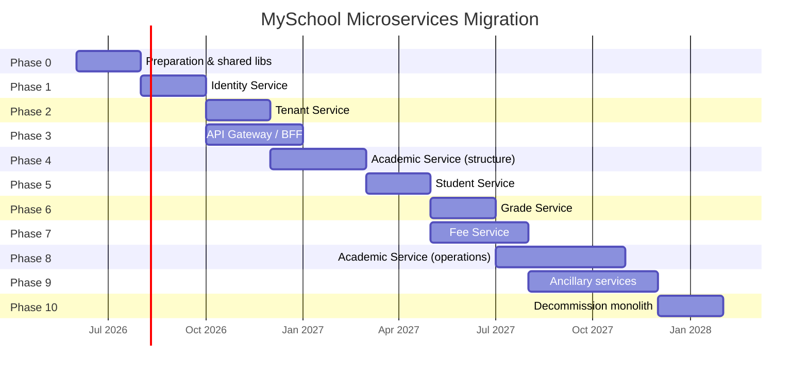

# Migration Roadmap

> Phased plan to migrate the MySchool monolith to a microservices architecture.  
> Assumes the six core services: **Identity**, **Tenant**, **Student**, **Academic**, **Grade**, **Fee**.

---

## Guiding Principles

1. **Strangler fig pattern** — Extract services incrementally; keep the monolith running until each boundary is stable.
2. **Database-first separation** — The master/tenant split already exists; next split tenant tables by schema before physical DB separation.
3. **No big bang** — Each phase delivers a deployable, testable increment.
4. **API compatibility** — Preserve existing REST contracts for the Angular frontend via gateway/BFF until the frontend can call services directly.
5. **Events over distributed transactions** — Replace cross-context SQL transactions (e.g., student enrollment) with sagas and outbox pattern.

---

## Recommended Extraction Order

| Order | Service | Rationale |
|-------|---------|-----------|
| **1** | Identity | No dependency on tenant data; all other services need auth. Lowest risk, highest leverage. |
| **2** | Tenant | Builds on Identity; enables independent tenant provisioning and registration workflow. |
| **3** | Academic (structure only) | Years, classes, stages, subjects, calendar — foundation referenced by Student, Grade, and Fee. |
| **4** | Student | Depends on Identity (users) and Academic (divisions). Unblocks Grade and Fee enrollment flows. |
| **5** | Grade | Depends on Student IDs and Academic calendar/subjects. Read-heavy; good candidate for caching. |
| **6** | Fee | Depends on Student and Academic (class fees). Most complex sagas (enrollment + billing). |
| **7+** | Academic (operations), Notifications, Reporting, AI | Large remaining Academic modules and cross-cutting concerns. |

### Why Identity First?

- `UserManager`, JWT issuance, and permission claims are already conceptually isolated in the master DB.
- `StudentManagementService`, `TeacherRepository`, `ManagerRepository`, and `GuardianRepository` all call `IUserRepository` / `UserManager` — extracting Identity first forces explicit APIs for user creation before Student/Academic extraction.
- No tenant DB dependency for core auth flows (`Login`, `Register`, `refresh`).

### Why Academic Structure Before Student?

- `Student.DivisionID` requires a valid division/class/stage/year chain.
- `StudentRepository.WhereEnrolledInAcademicYear()` joins through `Division → Class → Stage → Year`.
- Fee class mapping (`FeeClass.ClassID`) requires classes to exist.

### Why Student Before Grade and Fee?

- `MonthlyGrade.StudentID` and `StudentClassFees.StudentID` are hard FKs today.
- `StudentManagementService` creates accounts and fees during enrollment — Student API must exist before Fee saga can be finalized.

### Why Fee Last Among Core Six?

- Highest cross-service coupling: accounts, vouchers, student class fees, guardian links.
- `DashboardRepository` aggregates voucher totals — needs Fee events or query API.
- Financial data benefits from mature Identity and Student boundaries for auditability.

---

## Phase Overview



---

## Phase 0: Preparation (Weeks 1–8)

**Goal:** Establish foundations without changing runtime behavior.

### Deliverables

| Task | Details |
|------|---------|
| Create `docs/` architecture artifacts | ✅ This documentation set |
| Introduce shared class libraries (in solution, not yet deployed) | `MySchool.Shared.Contracts`, `MySchool.Shared.Auth`, `MySchool.Shared.Events` |
| Define service API contracts (OpenAPI specs) | One spec per target service |
| Add correlation ID middleware | Request tracing across future services |
| Introduce outbox table pattern (design only) | For eventual event publishing |
| Schema inventory script | Document which tenant tables map to which service |
| CI/CD pipeline template | Docker + deploy per service |

### Exit Criteria

- OpenAPI specs reviewed for Identity, Tenant, Student, Academic, Grade, Fee
- Team agrees on saga flows for student enrollment and tenant provisioning
- Shared package structure approved

---

## Phase 1: Extract Identity Service (Weeks 9–16)

**Goal:** Standalone auth service owning master Identity tables.

### Scope

| In Scope | Out of Scope |
|----------|--------------|
| `AuthController` login/register/refresh/logout | `select-tenant`, registration requests (Phase 2) |
| `RolePermissionsController` | Tenant membership |
| `PermissionClaimService`, `PermissionSeeder` | User creation for students/teachers (stays in monolith temporarily via internal API) |
| JWT issuance | |

### Steps

1. Create `Identity.Service` ASP.NET Core project (new — not done in this analysis phase).
2. Move `DatabaseContext` Identity-related DbSets; keep master DB connection.
3. Expose REST API matching current `/api/auth` endpoints (except tenant-specific).
4. Monolith validates JWT from Identity service (shared signing key or JWKS).
5. Add **internal** `POST /api/users` endpoint for monolith to create users during student/teacher enrollment.
6. Deploy Identity service; monolith delegates login/register to it via HTTP or shared reverse proxy path.

### Risks

- Token format must remain compatible with Angular app.
- `ValidateLifetime = false` today — decide whether to fix during migration.

### Exit Criteria

- Login/register/refresh work through Identity service
- Monolith still handles all school APIs
- Permission claims present in JWT as today

---

## Phase 2: Extract Tenant Service (Weeks 17–24)

**Goal:** Tenant registry, provisioning, registration workflow, and tenant selection.

### Scope

- `TenantController`, `TenantSeedController`, `DatabaseRestoreController`
- `AuthController` — `my-tenants`, `select-tenant`, registration request endpoints
- `TenantProvisioningService`, `TenantMembershipService`, `TenantDemoDataSeeder`
- Master DB: `Tenants`, `UserTenants`, `Subscriptions`, `TenantSettings`, `RegistrationRequests`

### Steps

1. Create `Tenant.Service` with master DB access (tenant tables only).
2. Move tenant provisioning logic; expose `POST /api/tenants` for new school creation.
3. Implement `GET /api/tenants/{id}/connection` (internal, authenticated) for other services.
4. `select-tenant` becomes orchestration: Tenant validates membership → Identity re-issues JWT with `TenantId` + permissions.
5. Monolith `TenantResolutionMiddleware` calls Tenant service (or reads from cache) instead of direct EF query.

### Exit Criteria

- New school provisioning works end-to-end via Tenant service
- Registration request approve/reject workflow functional
- Tenant connection resolution works for monolith school APIs

---

## Phase 3: API Gateway / BFF (Weeks 13–24, parallel with Phases 2–4)

**Goal:** Single entry point for Angular; route to monolith or extracted services.

### Options

| Option | Pros | Cons |
|--------|------|------|
| **YARP reverse proxy** | Simple path-based routing; minimal code | No aggregation logic |
| **Dedicated BFF** | Dashboard/platform admin aggregation | More code to maintain |
| **Azure API Management / Kong** | Enterprise features | Operational overhead |

### Routing (initial)

```
/api/auth/*          → Identity Service (except select-tenant → Tenant)
/api/tenant/*        → Tenant Service
/api/*               → Monolith (default)
```

### Steps

1. Deploy YARP or BFF in front of monolith + Identity + Tenant.
2. Point Angular `environment.apiUrl` to gateway.
3. Implement platform admin aggregation endpoints in BFF (replaces `DashboardRepository` multi-DB fan-out over time).

### Exit Criteria

- Angular works unchanged through gateway
- TLS and CORS configured at gateway

---

## Phase 4: Extract Academic Service — Structure (Weeks 25–36)

**Goal:** School structure, calendar, subjects, teachers, and course planning as independent service.

### Scope (first slice)

| Include | Defer to Phase 8 |
|---------|------------------|
| School, Class, Stage, Division, Subject | Attendance, Homework, Exams |
| Year, Term, Month, YearTermMonth | HR, Recruitment, Violations |
| Curriculum, CoursePlan, WeeklySchedule | Meetings, Activities, Analytics |
| Teacher, Manager (tenant side) | |

### Database Strategy

- Create `academic` schema in tenant DB.
- Move academic tables to schema (views in `dbo` for backward compatibility during transition).
- Academic service uses its own `AcademicDbContext`.

### Steps

1. Create `Academic.Service` with tenant connection resolved via Tenant service.
2. Extract repositories: `ClassesRepository`, `StagesRepository`, `DivisionRepository`, `SubjectRepository`, `YearRepository`, `TermRepository`, `MonthRepository`, `CurriculumRepository`, `CoursePlanRepository`, `WeeklyScheduleRepository`, `TeacherRepository`.
3. Gateway routes `/api/classes`, `/api/stages`, `/api/year`, etc. to Academic service.
4. Monolith `StudentRepository` calls Academic API to validate `DivisionID` (or reads from cache).
5. Remove extracted controllers from monolith.

### Cross-Service: Manager + Identity

- `ManagerRepository` user sync → Academic calls Identity `PATCH /api/users/{id}`.
- Platform admin cross-tenant manager catalog → BFF fans out to Academic service per tenant.

### Exit Criteria

- All structure/calendar/teacher APIs served by Academic service
- Student enrollment validates division via Academic API
- Monolith no longer contains structure controllers

---

## Phase 5: Extract Student Service (Weeks 37–44)

**Goal:** Student and guardian lifecycle as independent service.

### Scope

- `StudentsController`, `GuardianController`
- `StudentRepository`, `GuardianRepository`, `AttachmentsRepository` (student scope)
- `StudentManagementService` — refactored to saga orchestrator

### Student Enrollment Saga

```
┌──────────┐    ┌──────────┐    ┌──────────┐    ┌──────────┐
│  Client  │───►│ Student  │───►│ Identity │    │ Academic │
│          │    │ Service  │───►│ Service  │    │ Service  │
│          │    │          │───►│          │───►│ (validate│
│          │    │          │    │          │    │ division)│
│          │    │          │───►│ Fee Svc  │    │          │
└──────────┘    └──────────┘    └──────────┘    └──────────┘
                     │
                     ▼
              Compensating rollback
              on any step failure
```

### Steps

1. Create `Student.Service` with `student` schema in tenant DB.
2. Implement enrollment saga replacing single SQL transaction.
3. Identity user creation via `POST /api/users` (internal).
4. Fee account creation deferred to Phase 7 — temporarily call monolith Fee endpoints.
5. Gateway routes `/api/students`, `/api/guardian` to Student service.

### Exit Criteria

- CRUD for students and guardians works via Student service
- Enrollment saga tested with failure/compensation scenarios
- No direct `UserManager` usage in Student service

---

## Phase 6: Extract Grade Service (Weeks 45–52)

**Goal:** Grade types, monthly/termly grades, and daily evaluations.

### Scope

- `GradeTypesController`, `MonthlyGradesController`, `TermlyGradeController`, `DailyEvaluationController`
- `GradeTypesRepository`, `MonthlyGradeRepository`, `TermlyGradeRepository`, `DailyEvaluationService`

### Steps

1. Create `Grade.Service` with `grade` schema.
2. Validate `StudentID` via Student service; `SubjectID`, `YearID`, `TermID`, `MonthID` via Academic service.
3. Publish `GradePublished` domain events for Reporting service (future).
4. `IAuditTrailService` → emit `AuditEvent` to message bus or Audit service.
5. Gateway routes grade endpoints to Grade service.

### Exit Criteria

- Teachers can enter monthly and termly grades via Grade service
- Grade locking and override logs functional
- Report generation still works (monolith or BFF aggregates)

---

## Phase 7: Extract Fee Service (Weeks 45–56, overlaps Phase 6)

**Goal:** Fees, accounts, vouchers, and student billing.

### Scope

- `FeesController`, `FeeClassController`, `VouchersController`, `AccountsController`
- All fee repositories
- Complete enrollment saga Fee steps from Phase 5

### Steps

1. Create `Fee.Service` with `fee` schema.
2. Implement account and voucher APIs.
3. Wire Student enrollment saga to Fee service (create account, `AccountStudentGuardian`, `StudentClassFees`).
4. Publish `PaymentReceived` events for dashboard aggregates.
5. Gateway routes fee endpoints to Fee service.

### Exit Criteria

- Full student enrollment (guardian + student + account + fees) works across services
- Voucher recording and fee class mapping functional
- Dashboard money totals available via BFF aggregation or event projection

---

## Phase 8: Academic Service — Operations (Weeks 53–68)

**Goal:** Extract remaining Academic modules (attendance, homework, exams, HR, operations).

### Suggested Sub-Waves

| Wave | Modules | Weeks |
|------|---------|-------|
| 8a | Attendance, Homework, Exams | 4 |
| 8b | Employee HR, Recruitment, Time Capsule | 4 |
| 8c | Violations, Concerns, Meetings, Activities | 4 |
| 8d | Supervisor Visits, Teacher Feedback, Central Points, Organizational Plans | 4 |

### Exit Criteria

- Monolith contains no school-domain controllers
- All tenant business APIs served by microservices

---

## Phase 9: Ancillary Services (Weeks 69–84)

| Service | Source Modules |
|---------|----------------|
| Notification Service | `NotificationsController`, notification entities |
| Reporting Service | `ReportController`, `AnalyticsController`, analytics entities |
| File/Media Service | `FileController`, `mangeFilesService` |
| AI Assistant Service | `AiController`, `Services/Ai/*` |
| Audit Service | `AuditTrailService`, `AuditLog` |

### Exit Criteria

- Cross-cutting concerns extracted
- AI tools call service APIs instead of direct repository access

---

## Phase 10: Decommission Monolith (Weeks 85–92)

### Steps

1. Remove all controllers from monolith — verify zero traffic via gateway metrics.
2. Decompose `UnitOfWork` (should already be unused).
3. Remove shared `TenantDbContext` — each service has its own context.
4. Drop `dbo` compatibility views in tenant DBs.
5. Archive monolith repository; update CI/CD to deploy only microservices.
6. Performance test and capacity plan per service.

### Exit Criteria

- No deployment artifact for monolith
- All integration tests pass against microservices
- Runbook for tenant provisioning, migrations, and monitoring

---

## Cross-Cutting Workstreams (All Phases)

### A. Observability

| Item | Tool Suggestion |
|------|----------------|
| Distributed tracing | OpenTelemetry |
| Centralized logging | Seq, ELK, or Azure Monitor |
| Health checks | `/health` per service |
| Metrics | Prometheus + Grafana |

### B. Messaging

| Pattern | Use Case |
|---------|----------|
| Outbox | Reliable event publishing from each service |
| Saga orchestration | Student enrollment, tenant provisioning |
| Event bus | Azure Service Bus, RabbitMQ, or Kafka |

**Suggested events:**

- `TenantProvisioned`
- `UserCreated`
- `StudentEnrolled`
- `GradePublished`
- `PaymentReceived`
- `EmployeeHired`

### C. Multi-Tenancy Strategy

| Phase | Approach |
|-------|----------|
| 1–3 | Same as today: connection string per tenant from Tenant service |
| 4–7 | Schema-per-service within tenant DB |
| 8+ | Evaluate database-per-service for high-volume tenants |

### D. Data Migration

- No big-bang data migration needed initially — schema moves are metadata changes within same tenant DB.
- EF migrations become per-service (e.g., `Academic.Migrations`, `Student.Migrations`).
- Coordinate migration order: Academic schema → Student schema → Grade schema → Fee schema.

### E. Frontend Migration

| Phase | Frontend Change |
|-------|----------------|
| 0–3 | None — gateway preserves URLs |
| 4+ | Optional: split Angular feature modules to align with services |
| 10 | Consider module federation or separate SPAs per role |

### F. Testing Strategy

| Level | Scope |
|-------|-------|
| Contract tests | Pact or similar between services |
| Integration tests | Per-service with Testcontainers (SQL Server) |
| E2E tests | Angular Cypress/Playwright through gateway |
| Chaos tests | Tenant service unavailable, Identity token expiry |

---

## Risk Register

| Risk | Impact | Likelihood | Mitigation |
|------|--------|------------|------------|
| Student enrollment saga failures | High | Medium | Compensating transactions; idempotent APIs |
| JWT breaking change | High | Low | Contract tests with Angular; versioned token format |
| Platform admin dashboard regression | Medium | High | BFF aggregation with caching; phased rollout |
| EF migration conflicts across services | Medium | Medium | Schema separation; migration ownership per service |
| Team velocity slowdown | Medium | High | Extract Identity first for quick win; don't over-engineer Phase 0 |
| Operational complexity | Medium | High | Start with schema separation, not DB-per-service |

---

## Success Metrics

| Metric | Target |
|--------|--------|
| Monolith controller count | 0 by Phase 10 |
| Cross-DB repository classes | 0 by Phase 4 |
| Student enrollment saga success rate | ≥ 99.9% |
| API p95 latency per service | ≤ monolith baseline + 20% |
| Independent deploy frequency | Each service deployable weekly |
| Mean time to recovery (single service) | < 15 minutes |

---

## Quick Reference: Controller → Service Routing (End State)

| Route Prefix | Service |
|--------------|---------|
| `/api/auth/login`, `/register`, `/refresh`, `/logout` | Identity |
| `/api/auth/my-tenants`, `/select-tenant`, `/request-registration`, … | Tenant |
| `/api/role-permissions` | Identity |
| `/api/tenant`, `/api/tenantseed`, `/api/databaserestore` | Tenant |
| `/api/students`, `/api/guardian` | Student |
| `/api/school`, `/api/classes`, `/api/stages`, `/api/division`, `/api/subject`, `/api/year`, `/api/term`, `/api/month`, `/api/curriculms`, `/api/courseplans`, `/api/weeklyschedule`, `/api/teacher`, `/api/manager`, `/api/employees`, `/api/attendance`, `/api/homework`, `/api/exams`, `/api/recruitment`, … | Academic |
| `/api/gradetypes`, `/api/monthlygrades`, `/api/termlygrade`, `/api/daily-evaluations` | Grade |
| `/api/fees`, `/api/feeclass`, `/api/vouchers`, `/api/accounts` | Fee |
| `/api/notifications` | Notification |
| `/api/report`, `/api/analytics` | Reporting |
| `/api/ai` | AI Assistant |
| `/api/dashboard` | BFF |
| `/api/file` | File/Media |

---

## Next Steps (Post-Analysis)

1. Review and approve bounded context assignments with stakeholders.
2. Prioritize Phase 0 shared library creation.
3. Spike Identity service extraction (1–2 week proof of concept).
4. Define OpenAPI contracts for Identity and Tenant services.
5. Set up API gateway in development environment.

---

## Phase 2 Completed: API Gateway Foundation

**Status:** Implemented (June 2026)

The microservices folder structure and YARP API Gateway are in place. The monolith is **not** extracted; the gateway forwards all API traffic to the existing backend.

### What was delivered

| Item | Location |
|------|----------|
| Microservices layout | `MySchool-Microservices/` |
| YARP Gateway | `MySchool-Microservices/gateway/MySchool.Gateway/` |
| Monolith boundary (logical) | `MySchool-Microservices/services/MonolithService/` → `Backend/` |
| Angular frontend | `MySchool-Microservices/frontend/` (moved from `MySchool/`) |
| Shared placeholders | `MySchool-Microservices/shared/MySchool.Contracts/`, `MySchool.BuildingBlocks/` |
| Docker Compose stack | `docker-compose.yml` (gateway + monolithservice + sqlserver + frontend) |
| Gateway documentation | `MySchool-Microservices/docs/gateway-setup.md` |

### Gateway routing (current)

All routes forward to the monolith:

- `/api/auth/*` → MonolithService
- `/api/users/*` → MonolithService
- `/api/roles/*` → MonolithService
- `/api/*` → MonolithService
- `/uploads/*`, `/swagger/*` → MonolithService (compatibility)

### Frontend integration

- **Local dev:** `environment.development.ts` → `http://localhost:5001/api` (gateway)
- **Docker:** `environment.docker.ts` → `http://localhost:8081/api` (gateway on host)

### How to run

```bash
# Local: monolith + gateway + frontend (three terminals)
cd Backend && dotnet run
cd MySchool-Microservices/gateway/MySchool.Gateway && dotnet run
cd MySchool-Microservices/frontend && npx ng serve

# Docker
docker compose up -d --build
```

### Next phase

Proceed with **Phase 1: Extract Identity Service** per the roadmap above, adding Identity routes to the gateway before the monolith catch-all.

---

## Phase 3 Completed: Identity Service Extraction

See [identity-service-extraction.md](./identity-service-extraction.md) and the repository root [docs/identity-service-extraction.md](../../docs/identity-service-extraction.md).

Gateway now routes `/api/auth/*`, `/api/users/*`, `/api/roles/*`, and `/api/rolepermissions/*` to **Identity Service**; all other `/api/*` traffic goes to the monolith.

