# 🎓 MySchool
> Comprehensive School Management System

[](https://dotnet.microsoft.com/)
[](https://angular.io/)
[](https://www.microsoft.com/sql-server)
[](#license)

---

## 📋 Table of Contents
- [Overview](#overview)
- [Key Features](#key-features)
- [Architecture](#architecture)
- [Tech Stack](#tech-stack)
- [Installation & Setup](#installation--setup)
- [Configuration](#configuration)
- [Usage](#usage)
- [Folder Structure](#folder-structure)
- [API Documentation](#api-documentation)
- [Diagrams](#diagrams)
- [Roadmap](#roadmap)
- [Contributing](#contributing)
- [License](#license)

---

## 🎯 Overview

**MySchool** is a full-stack school management system designed to streamline educational institution operations. It provides a centralized platform for managing students, academic structures, grades, fees, and curriculum through a secure, role-based web application.

### Problem It Solves
- **Data Fragmentation**: Consolidates student records, grades, fees, and curriculum into a single source of truth
- **Manual Processes**: Automates fee tracking, grade entry, and report generation
- **Access Control**: Implements role-based access for administrators, teachers, and guardians
- **Multi-tenancy**: Supports multiple schools/tenants in a single deployment

### Why It Exists
Educational institutions require robust systems to manage complex relationships between students, teachers, classes, subjects, and financial records. MySchool provides an integrated solution that ensures data accuracy, operational efficiency, and stakeholder accessibility.

---

## ✨ Key Features

### 👨‍🎓 Student Management
- Complete student profiles with guardian linkage
- Academic year and class assignment tracking
- Student-specific fee and grade history
- Attachment management for documents

### 🏫 Academic Structure Management
- Hierarchical organization: Stages → Classes → Divisions
- Subject and curriculum assignment by class level
- Academic year and term configuration
- Teacher-class-subject assignment

### 💰 Financial Management
- Fee class definition and assignment
- Discount application and tracking
- Voucher generation and payment tracking
- Fee reports and analytics

### 📊 Grade & Assessment
- Monthly grade entry per subject
- Termly grade aggregation
- Grade type configuration (exam, quiz, homework)
- Comprehensive grade reports

### 📘 Curriculum & Course Management
- Dynamic course planning by academic year
- Subject-curriculum mapping
- Multi-level curriculum support

### 🔐 Multi-Tenant Architecture
- Isolated data per school/tenant
- Centralized tenant management
- Per-tenant database context

### 👥 Role-Based Access Control
- **Admin**: Full system access, tenant management, user creation
- **Teacher**: Grade entry, student data viewing, class management
- **Guardian**: Read-only access to assigned students' academic and financial records
- **Manager**: School-level administration and reporting

### 🌍 Internationalization
- Multi-language support (including Arabic)
- RTL (Right-to-Left) layout support
- Localized number and date formatting

---

## 🏗️ Architecture

MySchool follows a **three-tier architecture** with clear separation of concerns:

```mermaid
graph TB
    subgraph Client["🖥️ Client Layer"]
        UI[Angular 18 SPA]
        Store[NgRx State Management]
        UI --> Store
    end
    
    subgraph API["⚙️ API Layer"]
        Gateway[API Gateway]
        Auth[JWT Authentication]
        Controllers[Controllers]
        Services[Business Services]
        
        Gateway --> Auth
        Auth --> Controllers
        Controllers --> Services
    end
    
    subgraph Data["💾 Data Layer"]
        UOW[Unit of Work]
        Repos[Repositories]
        EF[Entity Framework Core]
        DB[(SQL Server)]
        
        Services --> UOW
        UOW --> Repos
        Repos --> EF
        EF --> DB
    end
    
    UI -->|HTTP/JSON| Gateway
    
    style Client fill:#e1f5ff
    style API fill:#fff4e1
    style Data fill:#e8f5e9
```



### Architecture Principles
- **Repository Pattern**: Abstraction over data access
- **Unit of Work**: Transaction management across repositories
- **Dependency Injection**: Loose coupling and testability
- **RESTful API**: Stateless, resource-based endpoints
- **JWT Authentication**: Stateless authentication with refresh tokens
- **Multi-tenancy**: Tenant isolation at database context level

---

## 🛠️ Tech Stack

### Frontend
| Technology | Version | Purpose |
|------------|---------|---------|
| **Angular** | 18.2.11 | SPA framework |
| **PrimeNG** | 18.0.2 | UI component library |
| **PrimeFlex** | 4.0.0 | CSS utility framework |
| **NgRx** | 18.1.1 | State management |
| **RxJS** | 7.8.1 | Reactive programming |
| **Chart.js** | 4.4.9 | Data visualization |
| **ngx-translate** | 16.0.4 | Internationalization |

### Backend
| Technology | Version | Purpose |
|------------|---------|---------|
| **.NET** | 8.0 | Runtime framework |
| **ASP.NET Core** | 8.0 | Web API framework |
| **Entity Framework Core** | 8.0.10 | ORM |
| **AutoMapper** | 14.0.0 | Object mapping |
| **JWT Bearer** | 8.0.10 | Authentication |
| **Swashbuckle** | 6.4.0 | API documentation |

### Database
| Technology | Purpose |
|------------|---------|
| **SQL Server** | 2022 Developer Edition |
| **Entity Framework Migrations** | Schema versioning |

### DevOps
| Technology | Purpose |
|------------|---------|
| **Docker** | Containerization |
| **Docker Compose** | Multi-container orchestration |

---

## 🚀 Installation & Setup

### Prerequisites
- **.NET SDK 8.0** or later
- **Node.js 18+** and npm
- **SQL Server 2022** (or use Docker)
- **Git**

### Option 1: Docker Compose (Recommended)

1. **Clone the repository**
   ```bash
   git clone https://github.com/AlyaariHazem/MySchool.git
   cd MySchool
   ```

2. **Set up environment variables**
   ```bash
   cp .env.example .env
   # Edit .env and set a strong MSSQL_SA_PASSWORD
   ```

3. **Start the application**
   ```bash
   docker-compose up -d
   ```

4. **Access the application**
   - Backend API: http://localhost:8080
   - Swagger UI: http://localhost:8080/swagger
   - SQL Server: localhost:1433

### Option 2: Local Development Setup

#### Backend Setup

1. **Navigate to Backend directory**
   ```bash
   cd Backend
   ```

2. **Restore dependencies**
   ```bash
   dotnet restore
   ```

3. **Update connection string**
   Edit `appsettings.json` and configure your SQL Server connection:
   ```json
   "ConnectionStrings": {
     "SqlAdminConnection": "Server=localhost;Database=MySchool;..."
   }
   ```

4. **Apply database migrations**
   ```bash
   dotnet ef database update
   ```

5. **Run the API**
   ```bash
   dotnet run
   ```
   
   API will be available at: https://localhost:7258

#### Frontend Setup

1. **Navigate to frontend directory**
   ```bash
   cd MySchool
   ```

2. **Install dependencies**
   ```bash
   npm install
   ```

3. **Start development server**
   ```bash
   npm start
   # or
   ng serve -o
   ```
   
   Application will open at: http://localhost:4200

---

## ⚙️ Configuration

### Environment Variables

Create a `.env` file in the root directory for Docker deployments:

| Variable | Description | Example |
|----------|-------------|---------|
| `MSSQL_SA_PASSWORD` | SQL Server SA password | `Str0ng!Passw0rd12345` |

### Backend Configuration (`appsettings.json`)

```json
{
  "ConnectionStrings": {
    "SqlAdminConnection": "Server=localhost;Database=MySchool;..."
  },
  "JWT": {
    "SecretKey": "your-secret-key-min-32-chars",
    "AudienceIP": "http://localhost:4200/",
    "IssuerIP": "http://localhost:7258/"
  },
  "AppSettings": {
    "Token": "your_long_secure_generated_key_here"
  }
}
```

### Frontend Configuration

API endpoint is configured in `environments/environment.ts`:
- **Development**: http://localhost:7258
- **Production**: Configure in `environment.prod.ts`

---

## 📖 Usage

### First-Time Setup

1. **Access the application** at http://localhost:4200
2. **Register as Admin** (first user becomes admin)
3. **Create a School/Tenant**
4. **Configure academic structure**:
   - Create academic years and terms
   - Define stages (e.g., Elementary, Middle, High)
   - Create classes and divisions
5. **Add subjects and curriculum**
6. **Register students and assign guardians**
7. **Configure fee classes and assign to students**
8. **Assign teachers to classes and subjects**

### Common Workflows

#### Adding a New Student
1. Navigate to Students → Add Student
2. Fill student information
3. Assign to academic year, class, and division
4. Link guardian(s)
5. Assign fee class

#### Recording Grades
1. Navigate to Grades → Monthly Grades
2. Select class, subject, and month
3. Enter grades for each student
4. Submit and generate reports

#### Managing Fees
1. Define Fee Class with fee amounts
2. Assign students to fee classes
3. Apply discounts if needed
4. Generate vouchers
5. Record payments

---

## 📁 Folder Structure

### Backend (`/Backend`)
```
Backend/
├── Controllers/          # API endpoints
│   ├── Identity/        # Auth controllers
│   └── School/          # School domain controllers
├── Models/              # Domain entities
├── DTOS/                # Data transfer objects
├── Data/                # EF DbContext & tenant management
├── Repository/          # Data access repositories
├── Services/            # Business logic layer
├── UnitOfWork/          # Transaction management
├── Interfaces/          # Service & repository contracts
├── Migrations/          # EF Core migrations
├── MappingConfig.cs     # AutoMapper profiles
└── Program.cs           # Application entry point
```

### Frontend (`/MySchool`)
```
MySchool/
├── src/
│   ├── app/
│   │   ├── components/       # Feature components
│   │   │   ├── admin/       # Admin dashboard & features
│   │   │   └── school/      # School-specific features
│   │   ├── core/            # Core services & guards
│   │   ├── shared/          # Shared components & utilities
│   │   ├── auth/            # Authentication logic
│   │   ├── state/           # NgRx state management
│   │   ├── directives/      # Custom directives
│   │   └── Pipes/           # Custom pipes
│   ├── assets/              # Static assets
│   └── environments/        # Environment configs
└── angular.json
```

---

## 🔌 API Documentation

### API Base URL
- **Development**: http://localhost:7258/api
- **Docker**: http://localhost:8080/api

### Swagger/OpenAPI
Interactive API documentation is available at:
- http://localhost:7258/swagger (local)
- http://localhost:8080/swagger (Docker)

### Key Endpoints

#### Authentication
- `POST /api/Auth/login` - User login
- `POST /api/Auth/register` - User registration
- `POST /api/Auth/refresh` - Refresh access token

#### Students
- `GET /api/Students` - List all students
- `POST /api/Students` - Create student
- `GET /api/Students/{id}` - Get student details
- `PUT /api/Students/{id}` - Update student
- `DELETE /api/Students/{id}` - Delete student

#### Grades
- `GET /api/MonthlyGrades` - Get monthly grades
- `POST /api/MonthlyGrades` - Record monthly grades
- `GET /api/TermlyGrade` - Get term grades

#### Fees
- `GET /api/FeeClass` - List fee classes
- `POST /api/Fees` - Create fee entry
- `GET /api/Vouchers` - Get payment vouchers

### Core Concepts

#### Multi-Tenancy
The system uses middleware-based tenant resolution. Each HTTP request is scoped to a tenant based on:
- User authentication claims
- Tenant identifier in the database context

#### Authentication Flow
1. User submits credentials to `/api/Auth/login`
2. Server validates and returns JWT access token + refresh token
3. Client includes access token in `Authorization: Bearer {token}` header
4. On token expiry, client uses refresh token to get new access token

---

## 📊 Diagrams

### Data Flow Diagram


### Component Interaction Diagram


### Database Schema Overview

```mermaid
erDiagram
    Student ||--o{ StudentClassFees : has
    Student ||--o{ AccountStudentGuardian : links
    Guardian ||--o{ AccountStudentGuardian : links
    Student ||--o{ MonthlyGrade : receives
    Student ||--o{ TermlyGrade : receives
    Class ||--o{ Student : contains
    Class ||--o{ Division : has
    Class ||--o{ CoursePlan : follows
    Subject ||--o{ MonthlyGrade : graded_in
    FeeClass ||--o{ StudentClassFees : assigned_to
    Teacher ||--o{ MonthlyGrade : enters
    Tenant ||--o{ Student : owns
    Tenant ||--o{ Class : owns
    
    Student {
        int Id
        string Name
        int ClassId
        int YearId
        int TenantId
    }
    
    Class {
        int Id
        string Name
        int StageId
        int TenantId
    }
    
    FeeClass {
        int Id
        string Name
        decimal Amount
        int TenantId
    }
    
    MonthlyGrade {
        int Id
        int StudentId
        int SubjectId
        int MonthId
        decimal Grade
    }
```

---

## 🗺️ Roadmap

### Completed ✅
- Multi-tenant architecture
- Student and guardian management
- Academic structure (stages, classes, divisions)
- Grade tracking (monthly and termly)
- Fee management and vouchers
- JWT authentication with refresh tokens
- Role-based access control
- Internationalization support

### Coming Soon 🚧
- **Attendance Tracking**: Daily attendance recording and reports
- **Timetable Management**: Class schedules and teacher timetables
- **Exam Management**: Exam scheduling and result publishing
- **Parent Portal**: Enhanced guardian dashboard with notifications
- **Mobile App**: iOS and Android applications
- **Reports & Analytics**: Advanced reporting dashboard
- **Communication Module**: Announcements and messaging
- **Library Management**: Book tracking and lending system
- **Transport Management**: Bus routes and student assignments
- **HR Module**: Staff management and payroll

### Future Considerations 💭
- Integration with learning management systems (LMS)
- Biometric attendance integration
- SMS and email notifications
- Online payment gateway integration
- Performance analytics and insights
- API rate limiting and caching
- Microservices architecture migration

---

## 🤝 Contributing

Contributions are welcome! Please follow these guidelines:

### Getting Started
1. Fork the repository
2. Create a feature branch: `git checkout -b feature/your-feature-name`
3. Commit your changes: `git commit -m 'Add some feature'`
4. Push to the branch: `git push origin feature/your-feature-name`
5. Open a Pull Request

### Development Guidelines
- Follow existing code style and conventions
- Write meaningful commit messages
- Add tests for new features
- Update documentation as needed
- Ensure all tests pass before submitting PR

### Code Style
- **Backend**: Follow C# coding conventions and .NET best practices
- **Frontend**: Follow Angular style guide and use ESLint/Prettier

### Reporting Issues
- Use GitHub Issues to report bugs
- Provide detailed description and steps to reproduce
- Include environment details (OS, .NET version, Node version)

### Pull Request Process
1. Update README.md with details of changes if applicable
2. Ensure the PR description clearly describes the problem and solution
3. Link any relevant issues
4. Request review from maintainers

---

## 📄 License

**TODO**: License information to be added.

For now, this project is private and proprietary. Please contact the repository owner for licensing inquiries.

---

## 📞 Support & Contact

- **Repository**: [github.com/AlyaariHazem/MySchool](https://github.com/AlyaariHazem/MySchool)
- **Issues**: [GitHub Issues](https://github.com/AlyaariHazem/MySchool/issues)
- **Maintainer**: [@AlyaariHazem](https://github.com/AlyaariHazem)

---

<div align="center">

**Made with ❤️ for educational institutions**

</div>
